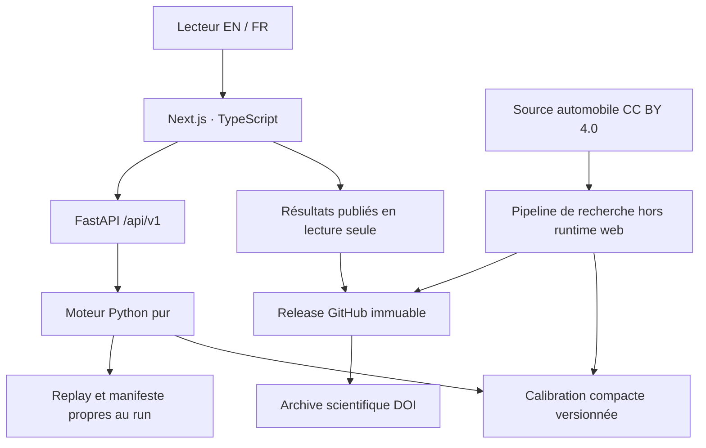

# Architecture retenue — ARCCRAFT Research Companion

Décision technique de phase 0, à implémenter après réconciliation éditoriale du gel. Cette page décrit le produit cible ; elle n’affirme pas que l’interface ou les services sont déjà développés.

## Frontières

La release citée et l’archive DOI sont les autorités. Le site vivant permet de consulter et de calculer ; il ne redéfinit pas les résultats publiés. Les originaux actuels restent des preuves historiques, même lorsque des corrections sont approuvées dans une nouvelle version.

## Composants

| Composant | Choix | Responsabilité |
|---|---|---|
| Web | Next.js App Router, TypeScript ; versions exactes verrouillées lors du scaffold | Rendu statique des pages, routes propres, SEO, navigation bilingue |
| Interactions | Composants clients limités au laboratoire, filtres et préférences | Aucun calcul scientifique implicite côté navigateur |
| API | Python/FastAPI, contrat v1, même dépôt et projet Vercel distinct | Validation, calcul borné, identité du build et manifests |
| Moteur synthétique | Module pur NumPy extrait et vérifié | Simulation, validateur, sous-flux, Atlas et recherche inverse |
| Automobile live | Fonction extraite avec calibration JSON vérifiée | Simulation fréquence–sévérité ; périodes enregistrées |
| Recherche hors web | pandas, SciPy, Matplotlib, notebooks, LaTeX | Fitting par police, figures, contrôles complets et réplication |
| Artefacts | JSON/CSV/PNG/PDF accompagnés de SHA-256 | Lecture et téléchargement contrôlés |
| Calcul long | CLI locale pour le MVP | Éviter de transformer un dépassement de quota en faux résultat |
| Archivage | GitHub release immuable + Zenodo ou équivalent | Conservation du code, données redistribuables, manifests et citations |

La [documentation Python Vercel](https://vercel.com/docs/functions/runtimes/python) confirme FastAPI et rappelle que les fichiers Python ne bénéficient pas d’un tree-shaking automatique. Le build doit sélectionner explicitement le moteur, la calibration et les dépendances runtime. Le routage mixte Next/Python sera validé sur Preview avant d’être considéré accepté ; les API ne doivent jamais être absorbées par une route frontend générique.

Les [limites Vercel](https://vercel.com/docs/functions/limitations) et les options du compte cible doivent être vérifiées au déploiement. Aucun budget ou nombre maximal de mondes public n’est supposé acquis par le benchmark Windows. Le fitting SciPy, les sources brutes, les notebooks, les artefacts d’audit et le SQLite de 205 Mo sont exclus du bundle de calcul.

## Routes

| EN | FR |
|---|---|
| `/en` | `/fr` |
| `/en/paper` | `/fr/article` |
| `/en/evidence` | `/fr/preuves` |
| `/en/figures` | `/fr/figures` |
| `/en/lab` | `/fr/laboratoire` |
| `/en/failure-atlas` | `/fr/failure-atlas` |
| `/en/data` | `/fr/donnees` |
| `/en/reproducibility` | `/fr/reproductibilite` |
| `/en/limitations` | `/fr/limites` |
| `/en/cite` | `/fr/citer` |

La racine redirige vers `/en`. Le changement de langue conserve la page sémantique et met à jour la langue du document. Les traductions partagent les identifiants scientifiques et jamais des copies divergentes des valeurs.

## Modèle de preuve

Chaque valeur rendue provient d’un enregistrement de métrique, jamais d’un nombre isolé dans un composant. Il porte : `metric_id`, définition et formule, unité et arrondi, population, période, valeur complète, `source_artifact_id`, référence paper/table/figure, version des données, version moteur/grammaire/calibration/produit/schéma, commit source, empreinte d’entrée, empreinte de sortie, environnement et statut de preuve. Les valeurs nulles signifient « indisponible » et ne sont pas remplacées par zéro.

Les dimensions sont séparées :

- Nature : `PUBLIC_EXTERNAL`, `DERIVED_RESULT`, `SYNTHETIC`, `AUTHORED_ARTIFACT`.
- Statut de publication : `CANDIDATE`, `PUBLISHED`, `SUPERSEDED`.
- Mode d’exécution : `CANONICAL_REPLAY`, `REGISTERED_VARIANT`, `EXPLORATORY`.
- État de vérification : `VERIFIED`, `DIVERGENT`, `NOT_VERIFIED`, `ENVIRONMENT_DIFFERENT`.

Une simulation peut être synthétique, rejouée exactement et non publiée. Un résultat historique peut être publié, pré-calculé et non recalculé dans le navigateur. Ces notions ne partagent pas un badge ambigu.

Le build échoue lorsqu’une métrique publiable n’a pas sa provenance complète. Une donnée historique dont le commit producteur est inconnu conserve ce constat : le nouveau commit de vérification n’est jamais présenté comme son producteur historique.

## Laboratoire et intégrité des runs

Les trois modes ont des panneaux, contrôles et résultats séparés. Le canonique verrouille paramètres, seed et versions. Les variantes ont un registre explicitement nommé. Toute modification utilisateur crée un résultat `EXPLORATORY` avec son propre identifiant et son manifeste.

Les contrôles doivent modifier effectivement la configuration serveur. Les choix pédagogiques non exécutés ne doivent pas apparaître comme paramètres de simulation. Le runtime ne persiste pas de mutation des artefacts publiés.

Le checksum de sortie scientifique exclut les métadonnées volatiles comme l’horodatage, la durée et l’UUID. Le fichier de résultat et le manifeste ont chacun leur propre empreinte. La règle historique d’arrondi à 12 décimales reste une version de comparaison distincte de la sérialisation pleine précision. Aucune tolérance ne change silencieusement après une divergence.

Le stress inverse dispose de son domaine de seed explicite. Pour un replay d’un monde, on rejoue le run de référence entier puis on sélectionne le monde : la seed maître seule ne garantit pas le même monde si le nombre de mondes ou l’ordre des tirages est modifié.

Le moteur historique ne place pas explicitement `statut_validation` dans chaque ligne de son Atlas. L’adaptateur cible enrichira les lignes à partir du résultat du monde afin de permettre les filtres exigés, sans changer le calcul. Les rejets auront `null` pour les métriques non définies et resteront exportables.

## API cible

| Route | Contrat |
|---|---|
| `GET /api/v1/health` | SHA du build, release, versions, disponibilité et checksum du manifeste ; aucun faux statut final sans DOI |
| `GET /api/v1/runs/canonical` | Référence immuable, paramètres, environnement, statut pré-calculé et fichiers vérifiés |
| `POST /api/v1/simulate/synthetic` | Mode, configuration enregistrée ou paramètres bornés ; rejet des champs inconnus |
| `POST /api/v1/simulate/motor` | Périodes contrôlées, seed, simulations, multiplicateurs ; frais/commissions explicitement hypothétiques |
| `GET /api/v1/artifacts/{id}` | Résolution par registre fermé, licence, empreinte et lien ; aucun chemin arbitraire |

Bornes de seed, nombres finis, taille de payload, budget de calcul et rate limiting doivent être appliqués au serveur. Un rate limiter uniquement en mémoire n’est pas suffisant entre instances serverless ; le choix d’une règle de plateforme ou d’un compteur partagé sera lié au plan retenu. Le mode simulation reste désactivé en production tant que cette protection n’est pas qualifiée.

Les 2022–2023 calibrent le moteur automobile. Les expositions/caractéristiques 2024 supposées connues à l’origine sont distinguées des réalisations 2024 utilisées pour évaluer. Aucun fitting silencieux sur les sinistres de l’année cible.

Une erreur ou un timeout efface l’état de succès du run courant et annonce l’échec. Les résultats précédents, s’ils restent consultables, gardent leurs paramètres et leur identifiant d’origine.

## Direction visuelle et accessibilité

Reprendre la grammaire éditoriale observée : titres serif, texte sans serif, métadonnées monospace, papier `#F4F1EA`, sombre `#18141F`, accent cobalt `#4A5CD8`, surfaces mates. Les composants seront réécrits pour éliminer les duplications constatées dans les captures.

Priorité à la lecture du paper et des limites. Les graphiques auront unités, axes, source, période, résumé textuel et CSV. Statuts par texte et formes, pas seulement couleur. Un `h1`, lien d’évitement, focus visible, contrôles labellisés, annonces de chargement/erreur, contraste des deux thèmes, reflow à 320 px et zoom 200 %. Les polices sont à sélectionner avec licence vérifiée et auto-hébergement.

## Livraison

Nouveau dépôt sans historique MAPTA/COMPASS, nouvelles variables et nouveau projet Vercel. Preview pour les PR, staging pour la revue scientifique, production depuis le commit approuvé. GitHub Actions vérifiera code, données, golden masters, routes, langues, thèmes, accessibilité et bundle.

La [release immuable GitHub](https://docs.github.com/en/code-security/concepts/supply-chain-security/immutable-releases) sera préparée en brouillon avec tous ses assets avant publication. DOI, citations, QR et PDF devront pointer vers la même version. L’absence d’archive DOI empêchera le statut final de publication scientifique.
